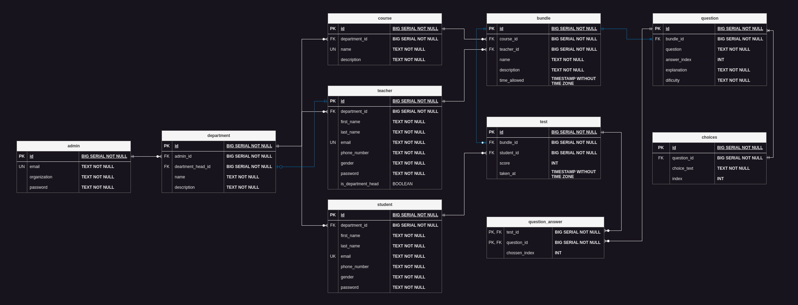

# Prepmaster API

Prepmaster API is a Spring Boot application developed as a Maven project. It provides a backend solution for the Prepmaster website, a practice exam platform designed for students preparing for the exit exams in Ethiopian Universities.

## Technologies Used

- Java
- Spring Boot
- Maven
- PostgreSQL
- Renderer (API Hosting)

## Dependencies

The following dependencies are used in this project:

- Spring Boot Web: Used for building RESTful APIs and handling HTTP requests.
- Spring Boot Data JPA: Provides support for data access using Java Persistence API (JPA) and Hibernate.
- PostgreSQL Driver: Enables connectivity between the application and the PostgreSQL database.

## Architecture

Prepmaster API follows the full N-tier architecture, ensuring a clear separation of concerns and modularity. The architecture consists of the following layers:

- **Presentation Layer**: Handles the presentation logic, including REST controllers and DTOs.
- **Service Layer**: Implements the business logic and coordinates the flow of data between the presentation and data access layers.
- **Data Access Layer**: Interacts with the PostgreSQL database using JPA repositories.

## Getting Started

To set up the Prepmaster API locally, follow these steps:

1. Clone the repository: `git clone https://github.com/your-repo/prepmaster-api.git`
2. Navigate to the project directory: `cd prepmaster-api`
3. Build the project: `mvn clean install`
4. Configure the PostgreSQL database connection in the `application.properties` file.
5. Run the application: `mvn spring-boot:run`

## Database ERD

Here is the Entity Relationship Diagram (ERD) for the Prepmaster API database:

## UI Show-Off

Prepmaster website provides a user-friendly interface for students to access practice exams. Below is a screenshot of the UI:

## Production Deployment

To deploy the Prepmaster API to the Renderer hosting service, follow these steps:

1. Set up an account on the Renderer platform.
2. Create a new project and configure the necessary settings.
3. Generate a production-ready JAR file: `mvn clean package`
4. Upload the JAR file to the Renderer platform.
5. Configure the environment variables and database connection in the Renderer settings.
6. Start the API on the Renderer platform.

## API Documentation

For detailed API documentation and endpoints, please refer to the Swagger UI or Postman collection provided.
